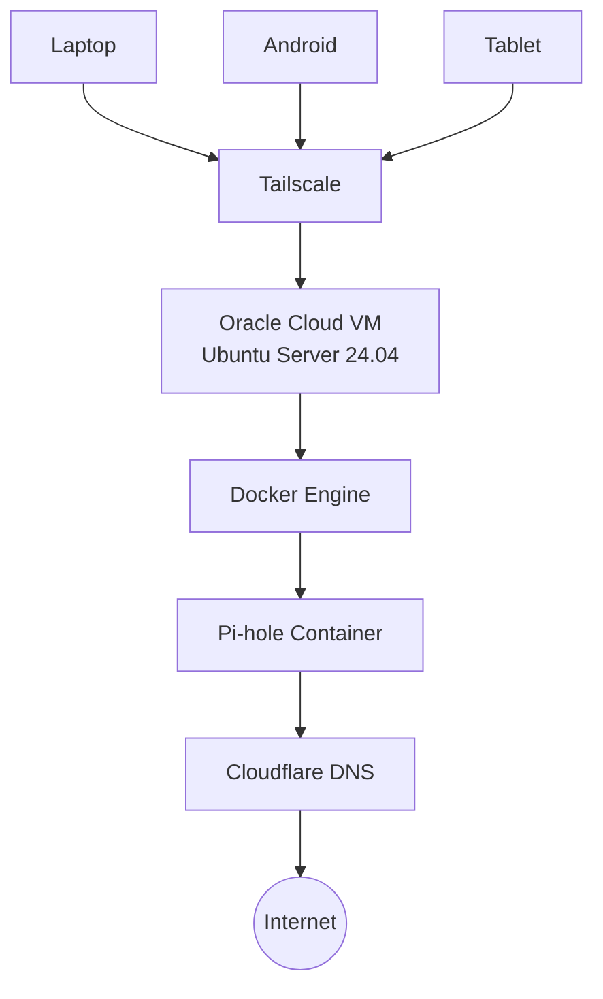

# Executive Summary

This project documents the design and deployment of a secure, cloud-hosted DNS filtering infrastructure using **Oracle Cloud Infrastructure (OCI)**, **Docker**, **Pi-hole**, and **Tailscale**.

The primary objective was to create a private DNS service capable of blocking advertisements, trackers, and known malicious domains while remaining securely accessible from authorized devices without exposing management interfaces to the public Internet.

The deployment leverages Oracle Cloud's Always Free resources, containerized services with Docker, and Tailscale's WireGuard-based mesh VPN to provide encrypted, private connectivity across multiple devices. Throughout the implementation, several practical challenges—including Linux DNS conflicts, Docker networking, OCI firewall configuration, and remote DNS validation—were identified and resolved, providing valuable experience in Linux system administration, cloud networking, containerization, and secure infrastructure design.

---

# Motivation

Modern web browsing extends far beyond desktop browsers. Mobile applications, smart devices, and operating system services frequently communicate with advertising networks, analytics platforms, telemetry services, and third-party domains.

Traditional browser extensions provide protection only within individual browsers and cannot filter DNS requests generated by applications or the operating system.

This project explores a network-level approach where every DNS request from trusted devices is evaluated before reaching an upstream resolver. By centralizing DNS filtering through Pi-hole, advertisement domains, trackers, and selected malicious domains can be blocked consistently across multiple devices.

Rather than exposing the DNS server directly to the Internet, all administrative access and DNS traffic are restricted to a private Tailscale network, reducing the attack surface while maintaining secure remote accessibility.

---

# Lab Environment

| Component | Configuration |
|-----------|---------------|
| Cloud Platform | Oracle Cloud Infrastructure (Always Free) |
| Region | Mumbai |
| Operating System | Ubuntu Server 24.04 LTS |
| Compute Shape | VM.Standard.A1.Flex |
| Container Runtime | Docker Engine |
| Container Orchestration | Docker Compose |
| DNS Filtering | Pi-hole |
| VPN | Tailscale |
| Firewall | UFW |
| Upstream Resolver | Cloudflare DNS |
| Remote Administration | SSH (Key-based Authentication) |

---

# Solution Architecture

The infrastructure is designed around a simple principle: **provide secure, private DNS filtering without exposing management interfaces to the public Internet.**

Rather than deploying Pi-hole on a local Raspberry Pi, the service is hosted on an Oracle Cloud Infrastructure (OCI) Always Free virtual machine. Docker is used to isolate the DNS service from the host operating system, while Tailscale provides secure WireGuard-based connectivity between trusted client devices and the cloud-hosted DNS server.

Only authenticated devices that belong to the private Tailnet can reach the Pi-hole DNS service or its administrative dashboard.

---

# Design Decisions

Rather than selecting technologies solely based on popularity, each component was chosen to satisfy a specific functional or security requirement. The objective was to build a cost-effective, maintainable, and secure DNS infrastructure while relying exclusively on open-source software and Oracle Cloud's Always Free resources.

| Technology | Purpose | Why it was Chosen |
|------------|---------|-------------------|
| **Oracle Cloud Infrastructure (OCI)** | Cloud Hosting | Provides an Always Free ARM-based virtual machine capable of running 24×7 without additional infrastructure costs. |
| **Ubuntu Server 24.04 LTS** | Operating System | Long-Term Support release offering stability, security updates, and excellent compatibility with Docker. |
| **Docker** | Container Runtime | Isolates Pi-hole from the host operating system, simplifies deployment, and enables portability. |
| **Docker Compose** | Service Orchestration | Allows the entire deployment to be managed through a single declarative configuration file, making recreation and maintenance straightforward. |
| **Pi-hole** | DNS Filtering | Performs network-wide advertisement, tracker, and malicious domain blocking before DNS requests reach upstream resolvers. |
| **Tailscale** | Private Networking | Creates an encrypted WireGuard-based mesh VPN, allowing secure access without exposing services to the public Internet. |
| **Cloudflare DNS** | Upstream Resolver | Provides reliable, low-latency recursive DNS resolution for requests that are not blocked by Pi-hole. |
| **UFW (Uncomplicated Firewall)** | Host Firewall | Restricts inbound traffic to only the required services, providing an additional layer of host-level security. |
| **SSH Key Authentication** | Remote Administration | Eliminates password-based logins, reducing the risk of brute-force attacks against the server. |

The combination of these technologies results in a lightweight infrastructure that is secure by default, easy to reproduce, and suitable for both learning and long-term personal use.

---

# Deployment

> *Coming Soon*

---

# Challenges & Troubleshooting

> *Coming Soon*

---

# Security Considerations

> *Coming Soon*

---

# Validation & Testing

> *Coming Soon*

---

# Lessons Learned

> *Coming Soon*

---

# Future Enhancements

> *Coming Soon*

---

# Conclusion

> *Coming Soon*
