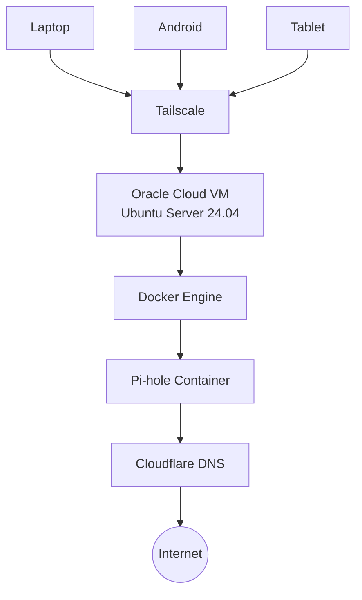

# Executive Summary

This project documents the design and deployment of a secure, cloud-hosted DNS filtering infrastructure using **Oracle Cloud Infrastructure (OCI)**, **Docker**, **Pi-hole**, and **Tailscale**.

The primary objective was to create a private DNS service capable of blocking advertisements, trackers, and known malicious domains while remaining securely accessible from authorized devices without exposing management interfaces to the public Internet.

The deployment leverages Oracle Cloud's Always Free resources, containerized services with Docker, and Tailscale's WireGuard-based mesh VPN to provide encrypted, private connectivity across multiple devices. Throughout the implementation, several practical challenges—including Linux DNS conflicts, Docker networking, OCI firewall configuration, and remote DNS validation—were identified and resolved, providing valuable experience in Linux system administration, cloud networking, containerization, and secure infrastructure design.

---

# Motivation

Modern web browsing extends far beyond desktop browsers. Mobile applications, smart devices, and operating system services frequently communicate with advertising networks, analytics platforms, telemetry services, and third-party domains.

Traditional browser extensions provide protection only within individual browsers and cannot filter DNS requests generated by applications or the operating system.

This project explores a network-level approach where every DNS request from trusted devices is evaluated before reaching an upstream resolver. By centralizing DNS filtering through Pi-hole, advertisement domains, trackers, and selected malicious domains can be blocked consistently across multiple devices.

Rather than exposing the DNS server directly to the Internet, all administrative access and DNS traffic are restricted to a private Tailscale network, reducing the attack surface while maintaining secure remote accessibility.

---

# Lab Environment

| Component | Configuration |
|-----------|---------------|
| Cloud Platform | Oracle Cloud Infrastructure (Always Free) |
| Region | Mumbai |
| Operating System | Ubuntu Server 24.04 LTS |
| Compute Shape | VM.Standard.A1.Flex |
| Container Runtime | Docker Engine |
| Container Orchestration | Docker Compose |
| DNS Filtering | Pi-hole |
| VPN | Tailscale |
| Firewall | UFW |
| Upstream Resolver | Cloudflare DNS |
| Remote Administration | SSH (Key-based Authentication) |

---

# Solution Architecture

The infrastructure is designed around a simple principle: **provide secure, private DNS filtering without exposing management interfaces to the public Internet.**

Rather than deploying Pi-hole on a local Raspberry Pi, the service is hosted on an Oracle Cloud Infrastructure (OCI) Always Free virtual machine. Docker is used to isolate the DNS service from the host operating system, while Tailscale provides secure WireGuard-based connectivity between trusted client devices and the cloud-hosted DNS server.

Only authenticated devices that belong to the private Tailnet can reach the Pi-hole DNS service or its administrative dashboard.

---

# Design Decisions

The infrastructure was designed with four primary objectives in mind:

- **Security** – Administrative access should never be publicly exposed.
- **Maintainability** – Services should be easy to deploy, update, and recover.
- **Cost Efficiency** – The entire solution should operate within Oracle Cloud's Always Free resources.
- **Portability** – The deployment should be reproducible on any compatible Linux host.

The following technologies were selected to achieve these objectives:

| Technology | Purpose | Design Rationale |
|------------|---------|------------------|
| **Oracle Cloud Infrastructure (OCI)** | Cloud Hosting | Provides an Always Free ARM-based virtual machine capable of hosting long-running services without recurring infrastructure costs. |
| **Ubuntu Server 24.04 LTS** | Operating System | A stable Long-Term Support release with strong community support and excellent compatibility with containerized workloads. |
| **Docker** | Container Runtime | Isolates Pi-hole from the host operating system, simplifying deployment, upgrades, and recovery. |
| **Docker Compose** | Service Orchestration | Enables infrastructure to be defined declaratively, making deployments repeatable and easier to maintain. |
| **Pi-hole** | DNS Filtering | Filters advertisements, trackers, and known malicious domains before forwarding legitimate DNS queries upstream. |
| **Tailscale** | Private Networking | Establishes an encrypted WireGuard-based mesh network, allowing secure access without exposing DNS or administrative interfaces to the public Internet. |
| **Cloudflare DNS** | Upstream Resolver | Provides reliable, low-latency recursive DNS resolution for permitted requests. |
| **UFW** | Host Firewall | Restricts inbound traffic to only the required services, reducing the server's exposed attack surface. |
| **SSH Key Authentication** | Remote Administration | Eliminates password-based authentication, mitigating brute-force login attempts. |

These design choices resulted in a lightweight, secure, and maintainable infrastructure that can be reproduced with minimal manual configuration.
---

# Deployment Overview

The solution was deployed on an Oracle Cloud Infrastructure (OCI) Always Free virtual machine running Ubuntu Server 24.04 LTS. The objective was to create a cloud-hosted DNS filtering service that remained accessible only through a private Tailscale network.

*Figure 1: Oracle Cloud Infrastructure Always Free virtual machine hosting the Pi-hole service.*

After provisioning the virtual machine, Docker Engine and Docker Compose were installed to provide a consistent and isolated runtime environment for Pi-hole. Running Pi-hole inside a container simplified deployment, configuration management, and future upgrades while keeping the host operating system independent of the application.

Persistent Docker volumes were configured to retain Pi-hole's settings, blocklists, and query history across container restarts and image updates.

*Figure 2: Pi-hole running as a healthy Docker container with the required DNS and web management ports exposed.*

Administrative access to the server was restricted to SSH key-based authentication, while Tailscale established an encrypted WireGuard-based mesh network between trusted client devices and the cloud-hosted DNS server. This approach eliminated the need to expose the DNS service or the Pi-hole administrative dashboard directly to the public Internet.

Once deployed, DNS queries from connected devices were securely routed through Tailscale to the Pi-hole instance. Pi-hole evaluated each request against its configured blocklists before forwarding permitted queries to Cloudflare's public recursive DNS servers.

*Figure 3: Pi-hole administrative dashboard displaying DNS query statistics, blocked requests, upstream DNS activity, and overall service health.*

The deployment required coordinated configuration across multiple layers, including Oracle Cloud networking, Ubuntu firewall rules, Docker networking, and DNS services, ensuring reliable communication while maintaining a minimal attack surface.

The deployment was validated by performing DNS lookups through the Pi-hole instance, confirming successful request processing and forwarding to the configured upstream resolver.

*Figure 4: Successful DNS resolution through the Pi-hole server confirms correct end-to-end functionality.*

---

# Challenges & Troubleshooting

> *Coming Soon*

---

# Security Considerations

> *Coming Soon*

---

# Validation & Testing

> *Coming Soon*

---

# Lessons Learned

> *Coming Soon*

---

# Future Enhancements

> *Coming Soon*

---

# Conclusion

> *Coming Soon*
