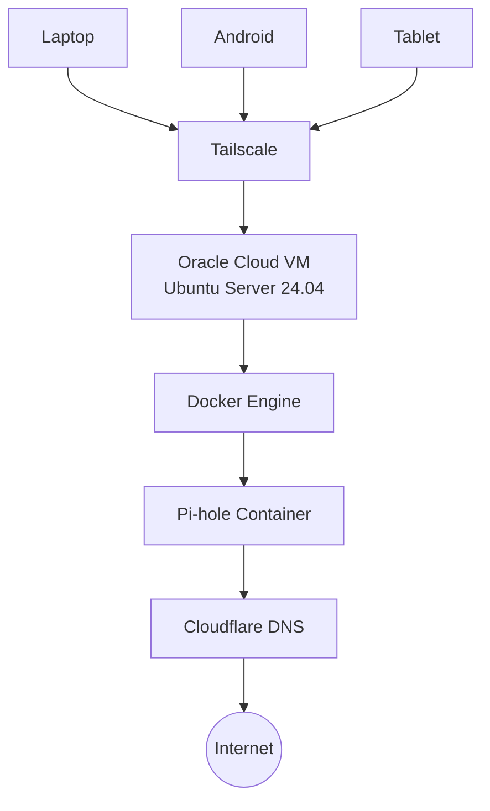

# Executive Summary

This project documents the design and deployment of a secure, cloud-hosted DNS filtering infrastructure using **Oracle Cloud Infrastructure (OCI)**, **Docker**, **Pi-hole**, and **Tailscale**.

The primary objective was to create a private DNS service capable of blocking advertisements, trackers, and known malicious domains while remaining securely accessible from authorized devices without exposing management interfaces to the public Internet.

The deployment leverages Oracle Cloud's Always Free resources, containerized services with Docker, and Tailscale's WireGuard-based mesh VPN to provide encrypted, private connectivity across multiple devices. Throughout the implementation, several practical challenges—including Linux DNS conflicts, Docker networking, OCI firewall configuration, and remote DNS validation—were identified and resolved, providing valuable experience in Linux system administration, cloud networking, containerization, and secure infrastructure design.

---

# Motivation

Modern web browsing extends far beyond desktop browsers. Mobile applications, smart devices, and operating system services frequently communicate with advertising networks, analytics platforms, telemetry services, and third-party domains.

Traditional browser extensions provide protection only within individual browsers and cannot filter DNS requests generated by applications or the operating system.

This project explores a network-level approach where every DNS request from trusted devices is evaluated before reaching an upstream resolver. By centralizing DNS filtering through Pi-hole, advertisement domains, trackers, and selected malicious domains can be blocked consistently across multiple devices.

Rather than exposing the DNS server directly to the Internet, all administrative access and DNS traffic are restricted to a private Tailscale network, reducing the attack surface while maintaining secure remote accessibility.

---

# Lab Environment

| Component | Configuration |
|-----------|---------------|
| Cloud Platform | Oracle Cloud Infrastructure (Always Free) |
| Region | Mumbai |
| Operating System | Ubuntu Server 24.04 LTS |
| Compute Shape | VM.Standard.A1.Flex |
| Container Runtime | Docker Engine |
| Container Orchestration | Docker Compose |
| DNS Filtering | Pi-hole |
| VPN | Tailscale |
| Firewall | UFW |
| Upstream Resolver | Cloudflare DNS |
| Remote Administration | SSH (Key-based Authentication) |

---

# Solution Architecture

The infrastructure is designed around a simple principle: **provide secure, private DNS filtering without exposing management interfaces to the public Internet.**

Rather than deploying Pi-hole on a local Raspberry Pi, the service is hosted on an Oracle Cloud Infrastructure (OCI) Always Free virtual machine. Docker is used to isolate the DNS service from the host operating system, while Tailscale provides secure WireGuard-based connectivity between trusted client devices and the cloud-hosted DNS server.

Only authenticated devices that belong to the private Tailnet can reach the Pi-hole DNS service or its administrative dashboard.

---

# Design Decisions

The infrastructure was designed with four primary objectives in mind:

- **Security** – Administrative access should never be publicly exposed.
- **Maintainability** – Services should be easy to deploy, update, and recover.
- **Cost Efficiency** – The entire solution should operate within Oracle Cloud's Always Free resources.
- **Portability** – The deployment should be reproducible on any compatible Linux host.

The following technologies were selected to achieve these objectives:

| Technology | Purpose | Design Rationale |
|------------|---------|------------------|
| **Oracle Cloud Infrastructure (OCI)** | Cloud Hosting | Provides an Always Free ARM-based virtual machine capable of hosting long-running services without recurring infrastructure costs. |
| **Ubuntu Server 24.04 LTS** | Operating System | A stable Long-Term Support release with strong community support and excellent compatibility with containerized workloads. |
| **Docker** | Container Runtime | Isolates Pi-hole from the host operating system, simplifying deployment, upgrades, and recovery. |
| **Docker Compose** | Service Orchestration | Enables infrastructure to be defined declaratively, making deployments repeatable and easier to maintain. |
| **Pi-hole** | DNS Filtering | Filters advertisements, trackers, and known malicious domains before forwarding legitimate DNS queries upstream. |
| **Tailscale** | Private Networking | Establishes an encrypted WireGuard-based mesh network, allowing secure access without exposing DNS or administrative interfaces to the public Internet. |
| **Cloudflare DNS** | Upstream Resolver | Provides reliable, low-latency recursive DNS resolution for permitted requests. |
| **UFW** | Host Firewall | Restricts inbound traffic to only the required services, reducing the server's exposed attack surface. |
| **SSH Key Authentication** | Remote Administration | Eliminates password-based authentication, mitigating brute-force login attempts. |

These design choices resulted in a lightweight, secure, and maintainable infrastructure that can be reproduced with minimal manual configuration.
---

# Deployment Overview

The solution was deployed on an Oracle Cloud Infrastructure (OCI) Always Free virtual machine running Ubuntu Server 24.04 LTS. The objective was to create a cloud-hosted DNS filtering service that remained accessible only through a private Tailscale network.

*Figure 1: Oracle Cloud Infrastructure Always Free virtual machine hosting the Pi-hole service.*

After provisioning the virtual machine, Docker Engine and Docker Compose were installed to provide a consistent and isolated runtime environment for Pi-hole. Running Pi-hole inside a container simplified deployment, configuration management, and future upgrades while keeping the host operating system independent of the application.

Persistent Docker volumes were configured to retain Pi-hole's settings, blocklists, and query history across container restarts and image updates.

*Figure 2: Pi-hole running as a healthy Docker container with the required DNS and web management ports exposed.*

Administrative access to the server was restricted to SSH key-based authentication, while Tailscale established an encrypted WireGuard-based mesh network between trusted client devices and the cloud-hosted DNS server. This approach eliminated the need to expose the DNS service or the Pi-hole administrative dashboard directly to the public Internet.

Once deployed, DNS queries from connected devices were securely routed through Tailscale to the Pi-hole instance. Pi-hole evaluated each request against its configured blocklists before forwarding permitted queries to Cloudflare's public recursive DNS servers.

*Figure 3: Pi-hole administrative dashboard displaying DNS query statistics, blocked requests, upstream DNS activity, and overall service health.*

The deployment required coordinated configuration across multiple layers, including Oracle Cloud networking, Ubuntu firewall rules, Docker networking, and DNS services, ensuring reliable communication while maintaining a minimal attack surface.

The deployment was validated by performing DNS lookups through the Pi-hole instance, confirming successful request processing and forwarding to the configured upstream resolver.

*Figure 4: Successful DNS resolution through the Pi-hole server confirms correct end-to-end functionality.*

---

# Challenges & Troubleshooting

Deploying a cloud-hosted DNS filtering service required integrating Oracle Cloud Infrastructure (OCI), Ubuntu Linux, Docker, Pi-hole, and Tailscale into a cohesive and secure solution. While each technology was relatively straightforward to configure independently, their interaction introduced several challenges that required careful investigation before the deployment became fully operational.

Rather than applying configuration changes indiscriminately, each issue was investigated by validating one infrastructure layer at a time—starting with the Linux host, followed by Docker networking, container configuration, cloud networking, and finally end-to-end DNS functionality. This systematic approach helped isolate root causes efficiently while minimizing unnecessary changes to the environment.

### Port 53 Conflict

The first challenge occurred during the initial deployment of the Pi-hole container. Docker was unable to start the container because Ubuntu's `systemd-resolved` service was already bound to port **53**, preventing Pi-hole from exposing its DNS service.

The issue was diagnosed by inspecting active network sockets and reviewing the host's DNS resolver configuration. Once the source of the conflict was identified, the resolver configuration was adjusted to allow Pi-hole exclusive access to the DNS port while preserving normal name resolution for the operating system.

This issue highlighted the importance of understanding how Linux system services interact with containerized applications, particularly when multiple services require access to the same network port.

### DNS Resolution Inside the Container

After resolving the port conflict, the Pi-hole container started successfully but was initially unable to resolve external domain names. As a result, Gravity updates failed and DNS queries could not be forwarded to upstream recursive resolvers.

Investigation of the container's resolver configuration revealed that it was inheriting Oracle Cloud Infrastructure's metadata DNS resolver through the host configuration. While suitable for the virtual machine itself, this configuration prevented Pi-hole from communicating correctly with its configured upstream DNS servers.

After correcting the upstream DNS configuration, Gravity updates completed successfully and external DNS resolution began functioning as expected.

This troubleshooting process demonstrated that reliable container networking depends not only on Docker configuration but also on the underlying operating system and cloud networking environment.

### Multi-Layer Network Configuration

Because the solution was hosted in Oracle Cloud Infrastructure and accessed through Tailscale, reliable communication depended on multiple networking layers working together correctly. Oracle Cloud security rules, Ubuntu firewall policies, Docker networking, and the private Tailscale mesh all required consistent configuration.

Each layer was validated independently to ensure DNS traffic could traverse the environment securely without exposing unnecessary services to the public Internet. Reviewing firewall policies and network paths helped confirm that trusted devices could access the Pi-hole instance while maintaining a minimal attack surface.

This reinforced the importance of validating infrastructure components individually rather than assuming connectivity issues originate from the application itself.

### End-to-End DNS Validation

After resolving the deployment and networking issues, the final step was to verify that DNS requests were actually being processed by Pi-hole instead of bypassing the filtering service.

DNS lookup tests confirmed that client requests successfully reached the Pi-hole instance, were evaluated against its filtering rules, and were forwarded to the configured upstream recursive DNS servers. Successful query resolution validated that the complete DNS filtering pipeline—from client request to upstream resolution—was functioning as designed.

Completing this validation provided confidence that the deployment was operating reliably under normal conditions and that each infrastructure component had been configured correctly.

> **Lessions from Troubleshooting:**  
> Resolving these challenges strengthened the reliability and maintainability of the deployment while providing practical experience in Linux administration, Docker networking, DNS infrastructure, and Oracle Cloud networking. More importantly, the project reinforced the value of systematic troubleshooting, root cause analysis, and validating each infrastructure layer independently before assuming application-level faults. The experience also highlighted that successful cloud deployments depend not only on correct configuration but on understanding how operating systems, containers, networking, and cloud services interact as a complete system.

---

# Security Considerations

Security was a primary design objective throughout the deployment. Rather than exposing the DNS service directly to the public Internet, multiple security controls were implemented across the cloud infrastructure, operating system, and application layers to reduce the overall attack surface.

### Private Network Access

The Pi-hole server was integrated with a private Tailscale mesh network, allowing trusted devices to securely access the DNS service without requiring inbound Internet exposure. This approach eliminated the need to publish DNS services publicly while enabling secure remote access from any authorized device.

### Secure Remote Administration

Administrative access to the Oracle Cloud virtual machine was restricted to SSH key-based authentication. Password-based login was avoided, reducing the risk of unauthorized access through credential guessing or brute-force attacks.

### Network Segmentation and Firewall Rules

Network access was controlled through multiple layers of security. Oracle Cloud Infrastructure Security Lists and Ubuntu's Uncomplicated Firewall (UFW) were configured to permit only the services required for administration and DNS functionality. Restricting unnecessary inbound traffic helped minimize the attack surface of the virtual machine.

### Container Isolation

Pi-hole was deployed as a Docker container, providing logical separation between the application and the underlying operating system. This approach simplified application updates, reduced configuration drift, and limited the impact of application-level issues on the host environment.

### DNS Privacy

Cloudflare's public DNS resolvers were configured as upstream recursive DNS servers to provide reliable external name resolution. Using encrypted upstream communication and a reputable DNS provider improved privacy while maintaining low-latency query performance.

### Persistent Data Management

Pi-hole configuration files and DNS blocklists were stored using Docker volumes rather than within the container itself. Separating persistent data from the application container simplified upgrades, reduced the risk of configuration loss, and improved recoverability in the event of container replacement.

> **Security Summary:**  
> The deployment follows a layered security approach by combining private network access, secure authentication, firewall enforcement, container isolation, and persistent configuration management. These measures reduce unnecessary exposure while maintaining a manageable and resilient self-hosted DNS infrastructure.

---

# Validation & Testing

Following deployment, a series of validation tests were performed to verify that each infrastructure component was functioning correctly and that DNS traffic flowed through the intended path.

### Container Health Verification

The Docker container was inspected to confirm that Pi-hole was running successfully and reporting a healthy operational status. This verified that the application, embedded DNS server, and web administration interface were initialized correctly.

### DNS Resolution Testing

DNS queries were executed directly against the local Pi-hole instance to verify that requests were successfully processed and forwarded to the configured upstream recursive DNS servers.

*Figure 4: Successful DNS resolution through the Pi-hole server confirms correct end-to-end functionality.*

Successful responses confirmed that client requests traversed the complete DNS filtering pipeline without errors.

### Pi-hole Dashboard Verification

The Pi-hole administrative dashboard was monitored to verify that DNS queries were being received, processed, and logged correctly. Query statistics, blocked requests, upstream resolver activity, and system health metrics confirmed that the service was operating as expected.

### Remote Connectivity Validation

Connectivity was verified from trusted devices connected through the private Tailscale mesh network. This confirmed that authorized devices could securely use the Pi-hole instance for DNS resolution without exposing the service directly to the public Internet.

### Infrastructure Validation Summary

The completed validation process confirmed that:

- Docker services were operating normally.
- Pi-hole successfully processed DNS requests.
- Gravity blocklists updated successfully.
- Upstream DNS resolution functioned correctly.
- Private DNS access through Tailscale operated as expected.
- Cloud networking and firewall policies permitted only the intended traffic.

> **Validation Summary:**  
> End-to-end testing confirmed that the deployed infrastructure operated reliably across compute, networking, containerization, and DNS services. The successful validation demonstrated that the environment met the project's functional and security objectives.

---

# Lessons Learned

This project provided valuable hands-on experience in designing, deploying, and troubleshooting a production-like self-hosted DNS infrastructure within a cloud environment. Beyond simply deploying Pi-hole, the project reinforced the importance of understanding how cloud networking, Linux services, containerization, and DNS infrastructure interact as an integrated system.

Working through deployment challenges highlighted the value of systematic troubleshooting and root cause analysis rather than relying on trial-and-error configuration changes. Investigating issues one infrastructure layer at a time significantly reduced troubleshooting complexity and improved confidence in the final deployment.

The project also strengthened practical experience with:

- Oracle Cloud Infrastructure networking and security configuration.
- Linux system administration and service management.
- Docker container deployment and persistent storage management.
- DNS architecture and recursive query processing.
- Secure private networking using Tailscale.
- Infrastructure validation and operational testing.

Most importantly, the deployment demonstrated that building reliable infrastructure requires more than installing software—it requires understanding how individual components interact to deliver a secure, maintainable, and resilient solution.

---

# Future Enhancements

Although the current deployment successfully provides secure private DNS filtering, several improvements could further enhance its functionality, scalability, and resilience.

Potential future enhancements include:

- Implementing automated backups for Pi-hole configuration and Gravity databases.
- Integrating monitoring and alerting using Prometheus and Grafana.
- Deploying redundant Pi-hole instances to improve availability.
- Automating infrastructure provisioning using Infrastructure as Code (Terraform).
- Configuring HTTPS with a reverse proxy for secure administrative access.
- Expanding the environment to support additional self-hosted network services.

These enhancements would further improve operational resilience while reducing manual administration as the infrastructure grows.

---

# Conclusion

This project successfully demonstrates the design and deployment of a secure, cloud-hosted private DNS infrastructure using Oracle Cloud Infrastructure, Ubuntu Server, Docker, Pi-hole, and Tailscale.

The resulting solution provides centralized DNS filtering, secure remote access through a private mesh network, and a lightweight deployment model that is both cost-effective and easy to maintain. Throughout the implementation, practical challenges involving Linux services, container networking, DNS resolution, and cloud networking were systematically investigated and resolved, resulting in a stable and reliable deployment.

Beyond achieving the project's functional objectives, this deployment provided practical experience across cloud infrastructure, Linux administration, containerization, networking, and infrastructure security. The knowledge gained throughout the design, troubleshooting, and validation phases significantly strengthened my understanding of how modern infrastructure components operate together in real-world environments.

Overall, this project highlights not only the successful implementation of a self-hosted DNS solution but also the engineering practices required to design, troubleshoot, secure, and validate cloud-native infrastructure.
