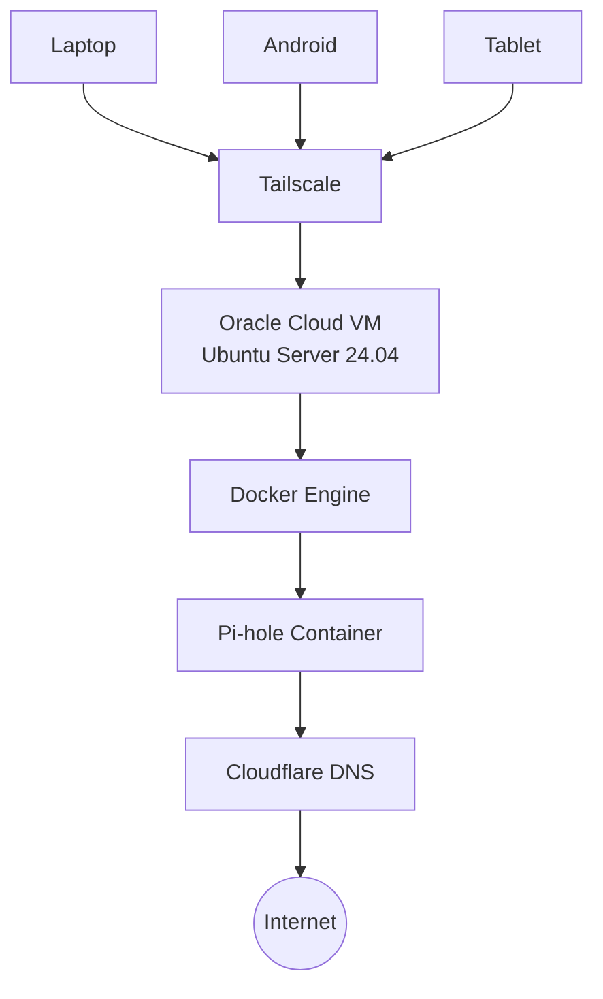

# Executive Summary

This project presents the design and deployment of a secure, cloud-hosted private DNS infrastructure using Oracle Cloud Infrastructure (OCI), Docker, Pi-hole, and Tailscale. The solution provides centralized DNS filtering for advertisements, trackers, and known malicious domains while restricting access to authorized devices through a private mesh network.

Built entirely on Oracle Cloud's Always Free resources, the deployment combines containerization, private networking, and layered security controls to deliver a lightweight, maintainable, and cost-effective self-hosted DNS service. Throughout the implementation, several infrastructure challenges—including Linux DNS conflicts, container networking, cloud firewall configuration, and end-to-end DNS validation—were systematically investigated and resolved.

### Key Outcomes

- Secure private DNS accessible only through a Tailscale mesh network.
- Network-wide blocking of advertisements, trackers, and selected malicious domains.
- Zero recurring infrastructure cost using Oracle Cloud Always Free resources.
- Layered security through SSH key authentication, Docker isolation, UFW, and OCI Security Lists.
- Practical experience with Linux administration, Docker, DNS infrastructure, cloud networking, and systematic troubleshooting.

---

# Motivation

Modern devices generate DNS requests far beyond web browsers. Mobile applications, smart devices, and operating system services routinely communicate with advertising networks, analytics platforms, telemetry services, and other third-party domains.

While browser-based ad blockers provide protection within individual browsers, they cannot filter DNS requests generated by applications or the operating system. As a result, unwanted network traffic often bypasses browser-level protections entirely.

This project addresses that limitation by implementing network-level DNS filtering using Pi-hole. By centralizing DNS resolution, advertisements, trackers, and selected malicious domains can be blocked consistently across all trusted devices without requiring software installation on each client.

To maintain a strong security posture, the DNS service and administrative interface remain accessible only through a private Tailscale mesh network rather than being exposed directly to the public Internet. This approach combines centralized filtering with secure remote accessibility while minimizing the infrastructure's attack surface.

---

# Lab Environment

The deployment was implemented using Oracle Cloud Infrastructure's Always Free resources and a collection of open-source technologies. The following environment served as the foundation for the project.

| Component | Configuration |
|-----------|---------------|
| Cloud Platform | Oracle Cloud Infrastructure (Always Free) |
| Region | Mumbai |
| Operating System | Ubuntu Server 24.04 LTS |
| Compute Shape | VM.Standard.A1.Flex |
| Container Runtime | Docker Engine |
| Container Orchestration | Docker Compose |
| DNS Filtering | Pi-hole |
| VPN | Tailscale |
| Firewall | UFW |
| Upstream Resolver | Cloudflare DNS |
| Remote Administration | SSH (Key-based Authentication) |

The selected components emphasize simplicity, reproducibility, and cost efficiency while demonstrating practical experience with cloud infrastructure, Linux administration, containerization, networking, and secure remote access.

---

# Solution Architecture

The infrastructure is designed around a simple principle: **provide secure, private DNS filtering without exposing management interfaces to the public Internet.**

Rather than hosting Pi-hole on a local device, the service runs on an Oracle Cloud Infrastructure (OCI) Always Free virtual machine. Docker isolates the application from the host operating system, while Tailscale provides secure WireGuard-based connectivity between trusted client devices and the cloud-hosted DNS server.

Only authenticated devices within the private Tailnet can access the Pi-hole DNS service and its administrative dashboard.

*Figure 1: High-level architecture of the cloud-hosted private DNS infrastructure.*

---

# Design Decisions

The infrastructure was designed around four primary objectives:

- **Security** – Administrative access should never be publicly exposed.
- **Maintainability** – Services should be easy to deploy, update, and recover.
- **Cost Efficiency** – The solution should operate entirely within Oracle Cloud's Always Free resources.
- **Portability** – The deployment should be reproducible on any compatible Linux host.

The following technologies were selected to achieve these objectives:

| Technology | Purpose | Design Rationale |
|------------|---------|------------------|
| **Oracle Cloud Infrastructure (OCI)** | Cloud Hosting | Provides an Always Free ARM-based virtual machine capable of hosting long-running services without recurring infrastructure costs. |
| **Ubuntu Server 24.04 LTS** | Operating System | Offers a stable Long-Term Support platform with excellent compatibility for containerized workloads. |
| **Docker** | Container Runtime | Isolates Pi-hole from the host operating system, simplifying deployment, upgrades, and recovery. |
| **Docker Compose** | Service Orchestration | Enables declarative, repeatable deployments through infrastructure configuration. |
| **Pi-hole** | DNS Filtering | Blocks advertisements, trackers, and known malicious domains before forwarding legitimate DNS queries upstream. |
| **Tailscale** | Private Networking | Provides encrypted WireGuard-based connectivity without exposing DNS or management interfaces to the public Internet. |
| **Cloudflare DNS** | Upstream Resolver | Delivers reliable, low-latency recursive DNS resolution for permitted requests. |
| **UFW** | Host Firewall | Restricts inbound traffic to only the services required for administration and DNS functionality. |
| **SSH Key Authentication** | Remote Administration | Eliminates password-based logins, reducing the risk of brute-force attacks. |

Together, these design decisions produced a lightweight, secure, and maintainable DNS infrastructure that is inexpensive to operate, easy to reproduce, and suitable for both learning and long-term self-hosting.

---

# Deployment Overview

The solution was deployed on an Oracle Cloud Infrastructure (OCI) Always Free virtual machine running Ubuntu Server 24.04 LTS. The deployment objective was to deliver a secure, cloud-hosted DNS filtering service that remained accessible only through a private Tailscale network.

*Figure 2: Oracle Cloud Infrastructure Always Free virtual machine hosting the Pi-hole service.*

After provisioning the virtual machine, Docker Engine and Docker Compose were installed to provide a consistent runtime environment for Pi-hole. Deploying the application as a container simplified configuration management, future upgrades, and recovery while keeping the host operating system independent of the application.

Persistent Docker volumes were configured to preserve Pi-hole settings, DNS blocklists, and query history across container updates and restarts.

*Figure 3: Pi-hole running as a healthy Docker container with the required DNS and web management ports exposed.*

Administrative access was secured using SSH key authentication, while Tailscale provided encrypted connectivity between trusted devices and the cloud-hosted DNS server. As a result, neither the DNS service nor the Pi-hole administrative dashboard required direct exposure to the public Internet.

Once deployed, DNS requests from connected devices were securely routed through Pi-hole, where they were evaluated against configured blocklists before permitted queries were forwarded to Cloudflare's public recursive DNS servers.

*Figure 4: Pi-hole administrative dashboard displaying DNS query statistics, blocked requests, upstream DNS activity, and overall service health.*

Reliable operation required coordinated configuration across Oracle Cloud networking, Ubuntu firewall rules, Docker networking, and DNS services. After validating each layer, DNS lookups confirmed successful request processing and upstream resolution.

*Figure 5: Successful DNS resolution through the Pi-hole server confirms correct end-to-end functionality.*

---

# Challenges & Troubleshooting

Deploying a cloud-hosted DNS filtering service required integrating Oracle Cloud Infrastructure (OCI), Ubuntu Linux, Docker, Pi-hole, and Tailscale into a cohesive solution. While each technology was straightforward to configure individually, their interaction introduced several challenges that required systematic troubleshooting.

Rather than applying configuration changes indiscriminately, each issue was investigated by validating one infrastructure layer at a time—starting with the Linux host, followed by Docker, container networking, cloud networking, and finally end-to-end DNS functionality. This structured approach helped isolate root causes while minimizing unnecessary changes.

### Port 53 Conflict

The first challenge occurred during the initial deployment when Docker was unable to start the Pi-hole container because Ubuntu's `systemd-resolved` service was already bound to port **53**.

Inspection of the host's network sockets and DNS resolver configuration identified the source of the conflict. Reconfiguring the system resolver allowed Pi-hole to bind successfully to the required DNS port while preserving normal host DNS functionality.

This highlighted the importance of understanding how Linux system services interact with containerized applications that require privileged network ports.

### DNS Resolution Inside the Container

After resolving the port conflict, the Pi-hole container started successfully but was initially unable to resolve external domain names. As a result, Gravity updates failed and DNS queries could not be forwarded to upstream resolvers.

Further investigation revealed that the container inherited Oracle Cloud's metadata DNS resolver through the host configuration, preventing communication with the configured upstream DNS servers. After correcting the upstream resolver configuration, Gravity updates completed successfully and DNS forwarding operated as expected.

This demonstrated that reliable container networking depends not only on Docker configuration but also on the underlying operating system and cloud environment.

### Multi-Layer Network Configuration

Reliable communication depended on several networking layers operating together correctly, including Oracle Cloud Security Lists, Ubuntu firewall rules, Docker networking, and the private Tailscale mesh network.

Each layer was validated independently to ensure trusted devices could securely access the Pi-hole service without exposing unnecessary services to the public Internet. This reinforced the value of troubleshooting infrastructure systematically rather than assuming application-level faults.

### End-to-End DNS Validation

Following deployment, DNS lookup tests verified that requests were successfully processed by Pi-hole before being forwarded to the configured upstream recursive DNS servers.

Successful query resolution confirmed that the complete DNS filtering pipeline—from client request to upstream resolution—was functioning as designed and that the deployed infrastructure operated reliably under normal conditions.

> **Lessons from Troubleshooting**  
> Resolving these challenges strengthened practical experience in Linux administration, Docker networking, DNS infrastructure, and Oracle Cloud networking. More importantly, the project reinforced the value of systematic troubleshooting, root cause analysis, and validating each infrastructure layer independently before assuming application-level faults.

---

# Security Considerations

Security was a core design objective throughout the deployment. Instead of relying on a single protection mechanism, the solution implements multiple security controls across the infrastructure, operating system, networking, and application layers to minimize the overall attack surface.

### Private Network Access

Rather than exposing the DNS service to the public Internet, Pi-hole is accessible only through a private Tailscale mesh network. This ensures that only authenticated devices within the Tailnet can reach the DNS service and administrative dashboard.

### Secure Remote Administration

Administrative access to the Oracle Cloud virtual machine is restricted to SSH key-based authentication. Eliminating password-based logins significantly reduces the risk of brute-force attacks and unauthorized access.

### Network Segmentation and Firewall Rules

Oracle Cloud Security Lists and Ubuntu's Uncomplicated Firewall (UFW) were configured to allow only the network services required for DNS functionality and remote administration. Restricting unnecessary inbound traffic reduces the exposed attack surface of the virtual machine.

### Container Isolation

Pi-hole runs inside a Docker container, isolating the application from the host operating system. This simplifies updates, reduces configuration drift, and minimizes the impact of application-level issues on the underlying host.

### DNS Privacy

Cloudflare's public recursive DNS servers were configured as upstream resolvers to provide reliable, low-latency DNS resolution. All client devices continue to use Pi-hole as their only DNS server, ensuring that filtering policies are applied before requests are forwarded upstream.

### Persistent Configuration

Pi-hole configuration files, blocklists, and query history are stored in Docker volumes, allowing container updates or replacement without losing application data or custom configuration.

> **Security Summary**  
> The deployment applies a defense-in-depth strategy by combining private network access, strong authentication, firewall enforcement, container isolation, and persistent configuration management. Together, these controls reduce unnecessary exposure while providing a secure, maintainable, and resilient self-hosted DNS infrastructure.

---

# Validation & Testing

Following deployment, a series of validation activities were performed to verify that the infrastructure operated as intended across compute, networking, containerization, and DNS services.

### Validation Activities

| Validation | Purpose | Result |
|------------|---------|--------|
| **Container Health Verification** | Confirm the Pi-hole container initialized successfully and reported a healthy operational status. | Successful |
| **DNS Resolution Testing** | Verify that DNS queries were processed by Pi-hole and forwarded to the configured upstream resolver. | Successful |
| **Pi-hole Dashboard Verification** | Confirm DNS requests, query statistics, and upstream resolver activity were recorded correctly. | Successful |
| **Remote Connectivity Validation** | Verify that trusted devices connected through the private Tailscale network could securely access the DNS service. | Successful |

*Figure 6: Successful DNS resolution through the Pi-hole server confirms correct end-to-end functionality.*

### Validation Results

The completed validation process confirmed that:

- Docker services initialized and operated normally.
- Pi-hole successfully processed DNS requests.
- Gravity blocklists updated successfully.
- Upstream DNS resolution functioned correctly.
- DNS queries were recorded in the Pi-hole dashboard.
- Trusted devices resolved DNS securely through the Tailscale network.
- Oracle Cloud networking and firewall policies permitted only the intended traffic.

> **Validation Summary**  
> End-to-end testing confirmed that the deployed infrastructure met the project's functional and security objectives, demonstrating reliable operation across cloud infrastructure, networking, containerization, and DNS services.

---

# Lessons Learned

Building and deploying this infrastructure provided practical experience beyond simply running Pi-hole. The project reinforced the importance of understanding how cloud infrastructure, Linux administration, containerization, networking, and DNS services interact to deliver a reliable production-style solution.

Key technical outcomes included:

- Deploying and administering Linux virtual machines on Oracle Cloud Infrastructure.
- Managing containerized applications using Docker and Docker Compose.
- Diagnosing networking issues across Linux, Docker, and cloud infrastructure.
- Understanding how DNS resolution, upstream resolvers, and filtering services operate together.
- Implementing secure remote administration through Tailscale and SSH key authentication.
- Applying systematic troubleshooting techniques to identify and resolve infrastructure issues.

The project also demonstrated that successful infrastructure deployment depends on careful planning, layered security, and methodical validation rather than simply installing software.

Beyond the technical implementation, the deployment strengthened confidence in designing, documenting, and maintaining a complete self-hosted service. These experiences are directly applicable to cloud engineering, DevOps, and infrastructure administration, where reliability, security, and operational thinking are as important as technical implementation.

---

# Future Enhancements

While the deployment successfully achieved its objectives, several enhancements could further improve reliability, scalability, and operational visibility:

- **Automated Backups:** Schedule regular backups of Pi-hole configuration, blocklists, and Docker volumes to simplify disaster recovery.

- **Monitoring and Alerting:** Integrate Prometheus and Grafana to monitor system health, resource utilization, and DNS performance through centralized dashboards and alerts.

- **High Availability:** Deploy a secondary Pi-hole instance to provide DNS redundancy and improve service availability during maintenance or failures.

- **Infrastructure as Code (IaC):** Automate infrastructure provisioning and application deployment using Terraform and Docker Compose to improve reproducibility and reduce manual configuration.

- **Reverse Proxy Integration:** Introduce a reverse proxy such as Nginx or Traefik to enable secure HTTPS access to additional self-hosted services when required.

- **Expanded Self-Hosted Services:** Extend the Oracle Cloud environment by deploying complementary services such as monitoring tools, network utilities, or lightweight home-lab applications.

These enhancements would improve resilience, observability, and automation while preserving the project's core objectives of security, maintainability, and cost efficiency.

---

# Conclusion

This project demonstrated the successful deployment of a secure, cloud-hosted DNS filtering solution using Oracle Cloud Infrastructure, Ubuntu Server 24.04 LTS, Docker, Pi-hole, and Tailscale. By combining containerization, private networking, layered security, and systematic validation, the deployment achieved its objectives while remaining entirely within Oracle Cloud's Always Free tier.

Beyond delivering a functional DNS service, the project provided practical experience in Linux administration, Docker, cloud infrastructure, networking, and DNS technologies. The troubleshooting process further reinforced the importance of methodical problem solving, layered security, and validating each infrastructure component independently.

Overall, this deployment demonstrates how open-source technologies and cloud platforms can be combined to build secure, reliable, and maintainable infrastructure with minimal cost. It serves not only as a functional self-hosted service but also as a practical foundation for continued learning in cloud engineering, DevOps, and infrastructure administration.

> **Key Technologies:** Oracle Cloud Infrastructure (OCI), Ubuntu Server 24.04 LTS, Docker, Docker Compose, Pi-hole, Tailscale, Cloudflare DNS, UFW, SSH Key Authentication.

---

# Skills Demonstrated

- Oracle Cloud Infrastructure (OCI)
- Linux Administration
- Docker & Docker Compose
- DNS Infrastructure
- Network Security
- Tailscale
- SSH
- Cloud Networking
- Infrastructure Troubleshooting
